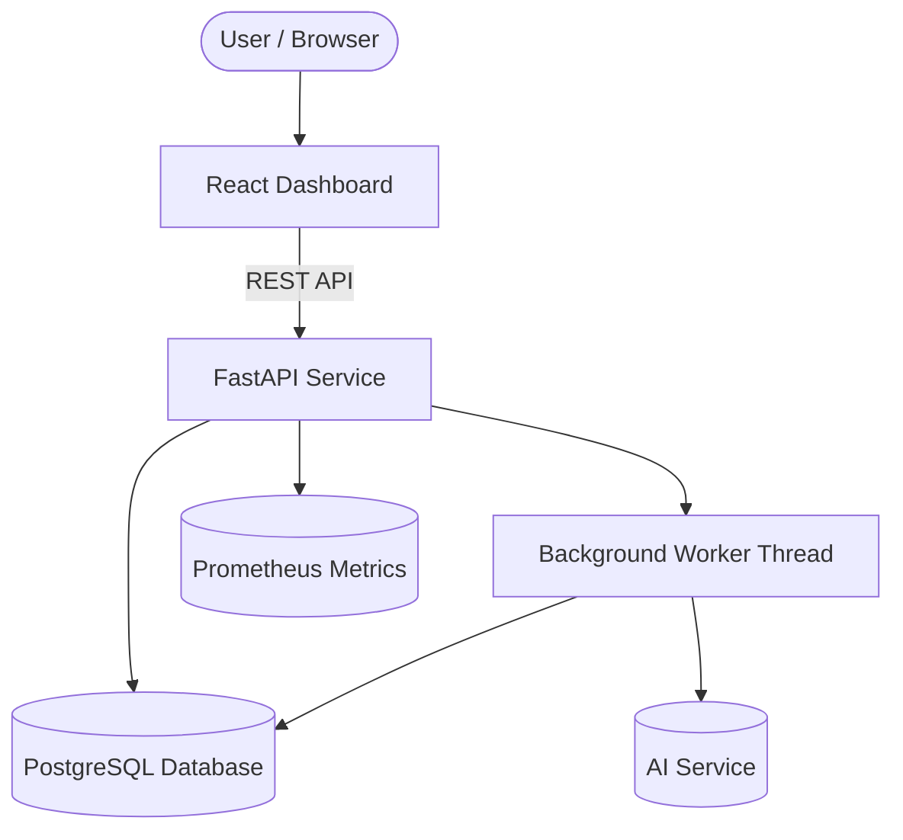
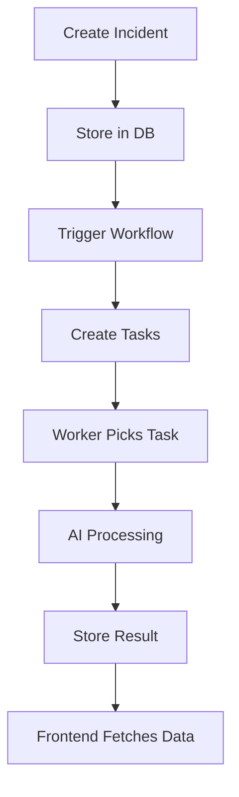
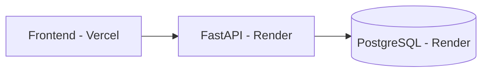

# 🚀 AI Workflow Automation Platform

A production-ready AI-powered workflow system that processes incidents, analyzes logs, generates recommendations, and provides observability through metrics and dashboards.

---

## 🔥 Live Demo

* 🌐 Frontend: https://your-vercel-url.vercel.app
* ⚙️ Backend API: https://ai-workflow-platform.onrender.com
* 📊 API Docs: https://ai-workflow-platform.onrender.com/docs

---

## 🧠 Overview

This system simulates a real-world **AI incident response pipeline**:

* Incident ingestion
* Workflow execution
* Asynchronous task processing
* AI-powered log analysis
* Recommendation generation
* Observability via metrics

---

## 🏗️ System Architecture



---

## ⚙️ Tech Stack

### Backend

* FastAPI
* SQLAlchemy ORM
* PostgreSQL
* Background Worker (thread-based)
* Prometheus (metrics)

### Frontend

* React (Create React App)
* Axios

### Deployment

* Render (Backend + DB)
* Vercel (Frontend)
* GitHub (CI/CD)

---

## 🔄 Execution Flow



---

## 📊 Key Features

* ✅ Asynchronous task processing
* 🔁 Retry with exponential backoff
* 🚫 Dead Letter Queue (DLQ) handling
* 🧠 AI-based log analysis
* 📈 Evaluation scoring system
* 📊 Metrics (latency, retries, failures)
* 🌐 Fully deployed full-stack system

---

## 🧪 API Endpoints

| Method | Endpoint                            | Description      |
| ------ | ----------------------------------- | ---------------- |
| POST   | `/incidents`                        | Create incident  |
| POST   | `/workflows/{id}/run/{incident_id}` | Trigger workflow |
| GET    | `/tasks`                            | Get recent tasks |
| GET    | `/tasks/{id}`                       | Task details     |

---

## 🖥️ Frontend Features

* Task monitoring dashboard
* Status tracking (Completed / Failed / Queued)
* Evaluation score display
* Auto-refresh system
* Detailed task view

---

## 🌍 Deployment Architecture



---

## 🚀 Local Setup

### 1. Clone repository

```bash
git clone https://github.com/your-username/ai-workflow-platform.git
cd ai-workflow-platform
```

---

### 2. Backend setup

```bash
pip install -r requirements.txt
uvicorn apps.api.main:app --reload
```

---

### 3. Frontend setup

```bash
cd frontend
npm install
npm start
```

---

## ⚠️ Environment Variables

### Backend

```env
DATABASE_URL=your_database_url
OPENAI_API_KEY=your_key (optional)
```

---

### Frontend

```env
REACT_APP_API_URL=https://ai-workflow-platform.onrender.com
```

---

## 📈 Observability

* Task success/failure tracking
* Retry metrics
* DLQ monitoring
* Latency histogram

---

## 💡 Design Decisions

* Worker merged into FastAPI (free deployment constraint)
* Retry + DLQ system for fault tolerance
* Enum-based state management
* Decoupled frontend and backend

---

## 🚧 Future Improvements

* WebSocket real-time updates
* Distributed workers (Celery/Kafka)
* Authentication system
* Advanced AI evaluation
* Grafana dashboards

---

## 💣 Challenges Solved

* Async workflows without Celery
* Retry + DLQ system design
* Observability integration
* Free-tier deployment constraints

---

## 📌 Author

Built by **Nandu Panakanti**

---

## ⭐ Support

If you like this project, give it a ⭐ on GitHub!
