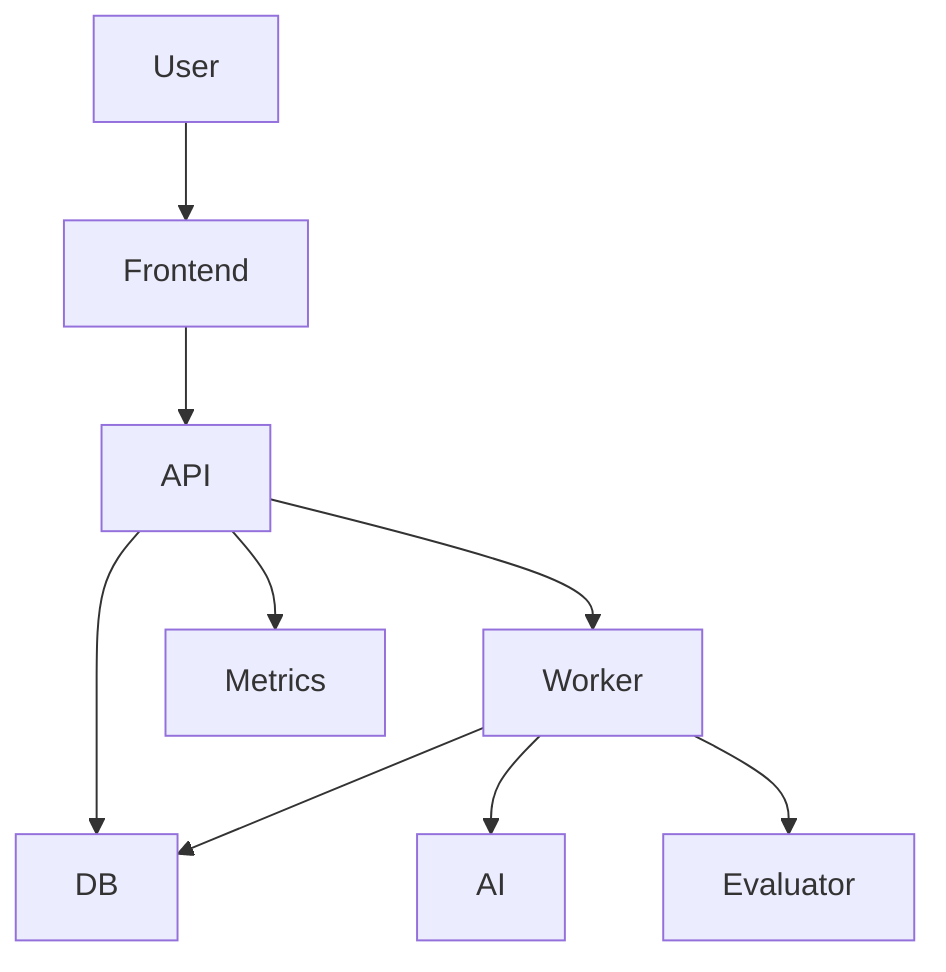
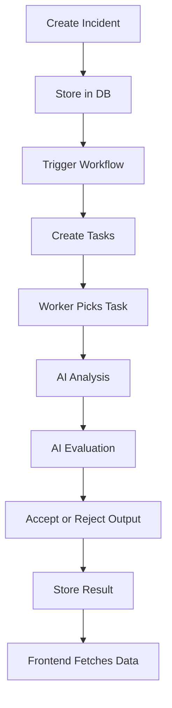
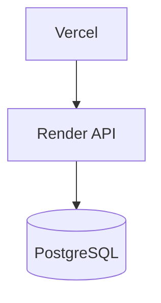

# 🚀 AI Workflow Automation Platform

A production-ready AI-powered workflow system that processes incidents, analyzes logs, generates intelligent recommendations, and self-evaluates output quality.

---

## 🔥 Live Demo

* 🌐 Frontend: https://ai-workflow-platform-sigma.vercel.app/
* ⚙️ Backend API: https://ai-workflow-platform.onrender.com
* 📊 API Docs: https://ai-workflow-platform.onrender.com/docs

---

## 🧠 Overview

This system simulates a real-world **AI-driven incident response pipeline**:

* Incident ingestion
* Workflow orchestration
* Asynchronous task execution
* AI-based log analysis
* Context-aware recommendation generation
* AI evaluation & quality scoring
* Observability via metrics

---

## ⚡ Try It (Demo Flow)

1. Open the frontend
2. Click **"Run Demo Workflow"**
3. System will:

   * Create an incident
   * Trigger workflow
   * Process tasks asynchronously
4. Watch tasks update in real-time

---

## 🏗️ System Architecture



---

## 🔄 Execution Flow



---

## 🧠 AI Pipeline (CORE DIFFERENTIATOR)

### 1. Log Analysis

* Extracts root cause
* Determines severity
* Generates recommendation

### 2. AI Evaluation Layer

* Scores output (0–100)
* Detects:

  * generic responses
  * incorrect reasoning
  * low-quality recommendations
* Rejects poor outputs automatically

---

## 📊 Example Output

```json
{
  "analysis": {
    "root_cause": "Database connection pool exhausted",
    "severity": "high",
    "recommendation": "Increase pool size and add retry logic"
  },
  "evaluation": {
    "score": 82,
    "confidence": "high",
    "issues": [],
    "reasoning": "Output matches logs and provides actionable steps"
  }
}
```

---

## ⚙️ Tech Stack

### Backend

* FastAPI
* SQLAlchemy ORM
* PostgreSQL
* Background Worker (thread-based)
* Prometheus metrics

### Frontend

* React (Create React App)
* Axios

### AI Layer

* LLM-based log analysis
* AI evaluation scoring system

### Deployment

* Render (Backend + DB)
* Vercel (Frontend)

---

## 📊 Key Features

* ✅ Asynchronous task processing
* 🔁 Retry with exponential backoff
* 🚫 Dead Letter Queue (DLQ)
* 🧠 AI-powered log analysis
* 🧪 AI output evaluation system
* 📈 Metrics (latency, retries, failures)
* 🎯 One-click demo workflow
* 🌐 Fully deployed system

---

## 🧪 API Endpoints

| Method | Endpoint                            | Description      |
| ------ | ----------------------------------- | ---------------- |
| POST   | `/incidents`                        | Create incident  |
| POST   | `/workflows/{id}/run/{incident_id}` | Trigger workflow |
| GET    | `/tasks`                            | Get tasks        |
| GET    | `/tasks/{id}`                       | Task details     |

---

## 🌍 Deployment Architecture



---

## 🚀 Local Setup

```bash
git clone https://github.com/your-username/ai-workflow-platform.git
cd ai-workflow-platform
```

### Backend

```bash
pip install -r requirements.txt
uvicorn apps.api.main:app --reload
```

### Frontend

```bash
cd frontend
npm install
npm start
```

---

## ⚠️ Environment Variables

### Backend

```env
DATABASE_URL=your_database_url
OPENAI_API_KEY=your_key
```

### Frontend

```env
REACT_APP_API_URL=https://ai-workflow-platform.onrender.com
```

---

## 📈 Observability

* Task success/failure tracking
* Retry metrics
* DLQ monitoring
* Latency histogram

---

## 💡 Design Decisions

* Worker embedded inside FastAPI (free-tier constraint)
* AI evaluation layer for quality control
* Fault-tolerant pipeline (retry + DLQ)
* Decoupled frontend/backend

---

## 🚧 Future Improvements

* Real-time updates (WebSockets)
* Distributed workers (Celery/Kafka)
* Advanced evaluation (multi-model scoring)
* Authentication & multi-user support

---

## 💣 Challenges Solved

* Async workflow without Celery
* AI hallucination control via evaluation
* Reliable retry + DLQ system
* Full deployment under free-tier constraints

---

## 📌 Author

Built by **Nandu Panakanti**

---

## ⭐ Support

If you like this project, give it a ⭐ on GitHub!
